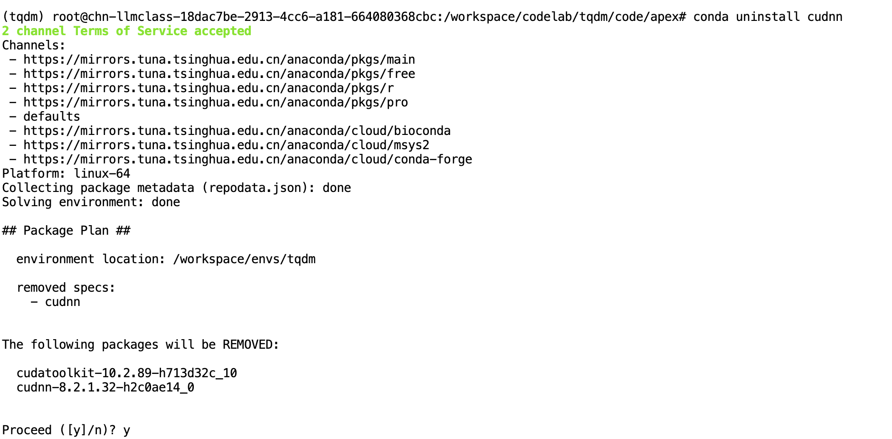
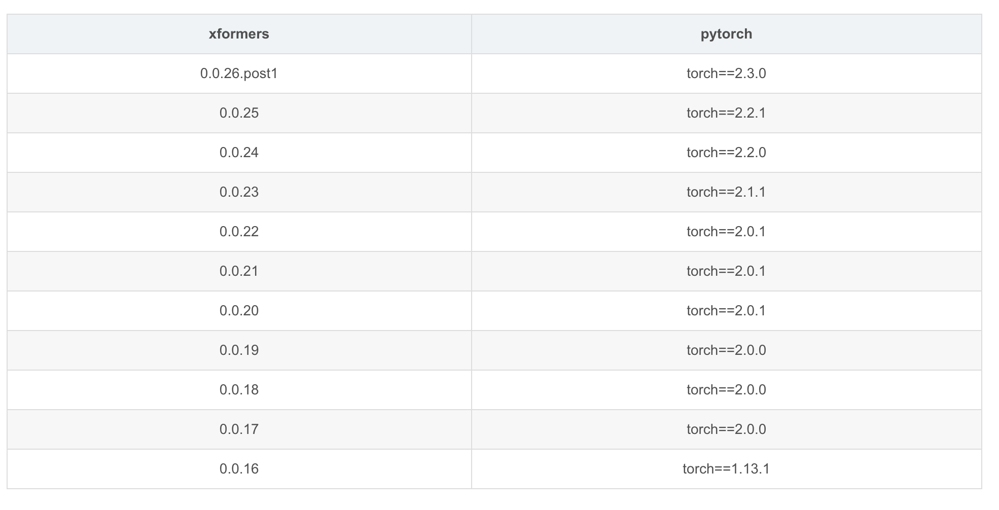

# [ECCV 2024] Textual Query-Driven Mask Transformer for Domain Generalized Segmentation
[](https://paperswithcode.com/sota/domain-generalization-on-gta5-to-cityscapes?p=textual-query-driven-mask-transformer-for) <br />
[](https://paperswithcode.com/sota/domain-generalization-on-gta-to-avg?p=textual-query-driven-mask-transformer-for) <br />
### [**Textual Query-Driven Mask Transformer for Domain Generalized Segmentation**](https://arxiv.org/abs/2407.09033)
>[Byeonghyun Pak](https://byeonghyunpak.github.io/)\*, [Byeongju Woo](https://byeongjuwoo.github.io/)\*, [Sunghwan Kim](https://sunghwan.me/)\*, [Dae-hwan Kim](https://scholar.google.com/citations?hl=en&user=_5Scn8YAAAAJ), [Hoseong Kim](https://scholar.google.com/citations?hl=en&user=Zy7Sz5UAAAAJ)†\
>Agency for Defense Development\
>ECCV 2024

#### [[`Project Page`](https://byeonghyunpak.github.io/tqdm/)] [[`Paper`](https://arxiv.org/abs/2407.09033)]

## Environment
### Requirements
- The requirements can be installed with:
  
  ```bash
  conda create -n tqdm python=3.9 numpy=1.26.4
  conda activate tqdm
  conda install pytorch==2.0.1 torchvision==0.15.2 pytorch-cuda=11.8 -c pytorch -c nvidia
  pip install -r requirements.txt
  pip install xformers==0.0.20
  pip install mmcv-full==1.5.3 
  pip install mmcv-full==1.7.2 -f https://download.openmmlab.com/mmcv/dist/cu118/torch2.0.0/index.html
  ```

  ```bash
  pip install torch==2.4.0 torchvision==0.19.0 torchaudio==2.4.0 --index-url https://download.pytorch.org/whl/cu124
  APEX_CPP_EXT=1 APEX_CUDA_EXT=1 APEX_ALL_CONTRIB_EXT=1 pip install -v --no-build-isolation .
  conda install -c conda-forge ninja
  conda install -c conda-forge -c nvidia nccl
  conda install -c conda-forge -c nvidia cudnn==8.9.2
  conda install -c nvidia cuda-toolkit=12.1 cuda-runtime=12.1 cuda-nvcc=12.1
  export CUDA_HOME="$CONDA_PREFIX"
  export CUDA_PATH="$CONDA_PREFIX"
  export PATH="$CONDA_PREFIX/bin:$PATH"
  export LD_LIBRARY_PATH="$CONDA_PREFIX/lib:$CONDA_PREFIX/lib64:${LD_LIBRARY_PATH}"
  export CPATH="$CONDA_PREFIX/include:$CPATH" 
  export LIBRARY_PATH="$CONDA_PREFIX/lib:$LIBRARY_PATH"
  export LD_LIBRARY_PATH="$CONDA_PREFIX/lib:$LD_LIBRARY_PATH"
  conda list | grep -i cudnn
  conda search -c conda-forge cudnn conda search -c nvidia cudnn
  pip install mmcv_full=='1.7.0+torch2.1.1cu121' -f https://modelscope.oss-cn-beijing.aliyuncs.com/releases/repo.html
  APEX_CPP_EXT=1 APEX_CUDA_EXT=1 APEX_ALL_CONTRIB_EXT=1 pip install -v --no-build-isolation .
  # 包含编译的cuda8.9.2.9
  conda install pytorch==2.1.1 torchvision==0.16.1 torchaudio==2.1.1 pytorch-cuda=12.1 -c pytorch -c nvidia
  conda install -c nvidia cuda-toolkit=12.1 cuda-nvcc=12.1
  conda install -c conda-forge ninja
  conda install -c conda-forge -c nvidia nccl
  conda install libgl
  ```
  

  

  ```bash
  pip install torch==2.0.0 torchvision==0.15.1 torchaudio==2.0.1 --index-url https://download.pytorch.org/whl/cu118
  pip install xformers==0.0.19
  # 如果您使用python3.10，torch 2.1.0和2.1.1，cuda 11.8.0，12.1.0，可以按照如下方式安装 版本1.7.0+torch2.1.1cu121 1.7.0+torch2.1.0cu121 1.7.0+torch2.1.1cu118 1.7.0+torch2.1.0cu118
  pip install mmcv_full==1.7.0 -f rm 
  ```

  ```bash
  pip install torch==2.1.1 torchvision==0.16.1 torchaudio==2.1.1 --index-url https://download.pytorch.org/whl/cu121
  pip install mmcv_full=='1.7.0+torch2.1.1cu121' -f https://modelscope.oss-cn-beijing.aliyuncs.com/releases/repo.html
  
  ```

  ```python
  File "/root/miniconda3/envs/tqdm_py310/lib/python3.10/site-packages/mmcv/utils/config.py", line 508
  try:
      text, _ = FormatCode(text, style_config=yapf_style, verify=True)
  except:
      text, _ = FormatCode(text, style_config=yapf_style)
  ```
### Pre-trained VLM Models
- Please download the pre-trained CLIP and EVA02-CLIP and save them in `./pretrained` folder.

  | Model | Type | Link |
  |-----|-----|:-----:|
  | CLIP | `ViT-B-16.pt` |[official repo](https://github.com/openai/CLIP/blob/a1d071733d7111c9c014f024669f959182114e33/clip/clip.py#L30)|
  | EVA02-CLIP | `EVA02_CLIP_L_336_psz14_s6B` |[official repo](https://github.com/baaivision/EVA/tree/master/EVA-CLIP#eva-02-clip-series)|

### Checkpoints
- You can download **tqdm** model checkpoints:

  | Model | Pretrained | Trained on | Config | Link |
  |-----|-----|-----|-----|:-----:|
  | `tqdm-clip-vit-b-gta` | CLIP | GTA5 | [config](https://github.com/ByeongHyunPak/tqdm/blob/main/configs/tqdm/tqdm_clip_vit-l_1e-5_20k-g2c-512.py) |[download link](https://drive.google.com/file/d/1oKTIuPoXTJyOqqof1yqtb10m41nVkreM/view?usp=drive_link)|
  | `tqdm-eva02-clip-vit-l-gta` | EVA02-CLIP | GTA5 | [config](https://github.com/ByeongHyunPak/tqdm/blob/main/configs/tqdm/tqdm_eva_vit-l_1e-5_20k-g2c-512.py) |[download link](https://drive.google.com/file/d/1niKdUcoeP9Gd4F2O0LikTHBg39xHO8j0/view?usp=drive_link)|
  | `tqdm-eva02-clip-vit-l-city` | EVA02-CLIP | Cityscapes | [config](https://github.com/ByeongHyunPak/tqdm/blob/main/configs/tqdm/tqdm_eva_vit-l_1e-4_20k-c2b-512.py) |[download link](https://drive.google.com/file/d/1_FXNthSshuvGraEX-2JxQWsGvtpeG9A7/view?usp=drive_link)|

## Datasets
- To set up datasets, please follow [the official **TLDR** repo](https://github.com/ssssshwan/TLDR/tree/main?tab=readme-ov-file#setup-datasets).
  ```bash
  python tools/convert_datasets/gta.py data/gta --nproc 8
  python tools/convert_datasets/cityscapes.py data/cityscapes --nproc 8
  ```
- After downloading the datasets, edit the data folder root in [the dataset config files](https://github.com/ByeongHyunPak/tqdm/tree/main/configs/_base_/datasets) following your environment.
  
  ```python
  src_dataset_dict = dict(..., data_root='[YOUR_DATA_FOLDER_ROOT]', ...)
  tgt_dataset_dict = dict(..., data_root='[YOUR_DATA_FOLDER_ROOT]', ...)
  ```
## Train
 ```
 bash dist_train.sh configs/[TRAIN_CONFIG] [NUM_GPUs]
```
  - `[TRAIN_CONFIG]`: Train configuration file (e.g., `tqdm/tqdm_eve_vit-l_1e-5_20k-g2c-512.py`)
  - `[NUM_GPUs]`: Number of GPUs used for training
## Test
To enable multi-scale flip augmentation during testing, use the `--aug-test` option.

**Note:** The experiment results in our main paper were obtained **without** multi-scale flip augmentation.

```
bash dist_test.sh configs/[TEST_CONFIG] work_dirs/[MODEL] [NUM_GPUs] --eval mIoU
```
  - `[TRAIN_CONFIG]`: Test configuration file (e.g., `tqdm/tqdm_eve_vit-l_1e-5_20k-g2b-512.py`)
  - `[MODEL]`: Model checkpoint (e.g., `tqdm_eve_vit-l_1e-5_20k-g2c-512/epoch_last.pth`)
  - `[NUM_GPUs]`: Number of GPUs used for testing
 
## The Most Relevant Files
- [configs/tqdm/*](https://github.com/ByeongHyunPak/tqdm/tree/main/configs/tqdm) - Config files for the final tqdm
- [models/segmentors/*](https://github.com/ByeongHyunPak/tqdm/tree/main/models/segmentors) - Overall tqdm framework
- [mmseg/models/utils/assigner.py](https://github.com/ByeongHyunPak/tqdm/blob/main/mmseg/models/utils/assigner.py#L168) - Implementation of fixed matching
- [mmseg/models/decode_heads/tqdm_head.py](https://github.com/ByeongHyunPak/tqdm/blob/main/mmseg/models/decode_heads/tqdm_head.py) - Our textual object query-based segmentation head
- [mmseg/models/plugins/tqdm_msdeformattn_pixel_decoder.py](https://github.com/ByeongHyunPak/tqdm/blob/main/mmseg/models/plugins/tqdm_msdeformattn_pixel_decoder.py) - Our pixel decoder with *text-to-pixel attention*

## Citation
If you find our code helpful, please cite our paper:
```bibtex
@inproceedings{pak2024textual,
  title={Textual Query-Driven Mask Transformer for Domain Generalized Segmentation},
  author={Pak, Byeonghyun and Woo, Byeongju and Kim, Sunghwan and Kim, Dae-hwan and Kim, Hoseong},
  booktitle={European Conference on Computer Vision},
  pages={37--54},
  year={2024},
  organization={Springer}
}
```

## Acknowledgements
This project is based on the following open-source projects.
We thank the authors for sharing their codes.
- [MMSegmentation](https://github.com/open-mmlab/mmsegmentation)
- [DAFormer](https://github.com/lhoyer/DAFormer)
- [TLDR](https://github.com/ssssshwan/TLDR)


=== Road3D 测试集场景 ===
x0613_1627
x2021_0222_1737
x2021_0222_1743
x2021_0222_1757
x2021_0223_1310
x2021_0223_1857
y0602_1107
y0602_1309
y0609_1923
y0609_1924
y0613_1241
y0613_1242
y0613_1248
y0616_1741
y0616_1747
y0616_1749
y2021_0222_1744_2
y2021_0223_1448
y2021_0223_1454
y2021_0223_1600
y2021_0223_1604
y2021_0223_1700
y2021_0228_1811
y2021_0403_1736
y2021_0403_1744
y2021_0403_1858

=== ORFD 训练集场景 ===
c2021_0228_1819
x0613_1627
x2021_0222_1720
x2021_0222_1810
x2021_0223_1310
x2021_0223_1316
y0602_1228
y0602_1235
y0609_1639
y0609_1750
y0609_1954
y0609_1959_2
y0613_1238
y0613_1248
y0613_1252
y0613_1304
y0613_1509
y0613_1632
y0616_1750
y0616_1950
y2021_0228_1807

=== 重叠的场景 ===
x0613_1627
x2021_0223_1310
y0613_1248


逐场景 mIoU 对比结果

  | 场景             | File1 mIoU | File2 mIoU | 差异       |
  |------------------|------------|------------|------------|
  | 0602-1107        | 0.8479     | 0.8453     | -0.26%     |
  | 0602-1309        | 0.8865     | 0.9781     | +9.17%     |
  | 0609-1923        | 0.6675     | 0.9599     | +29.23% ⬆️ |
  | 0609-1924        | 0.6752     | 0.9046     | +22.93% ⬆️ |
  | 0613-1241        | 0.8819     | 0.9094     | +2.74%     |
  | 0613-1242        | 0.9378     | 0.9569     | +1.91%     |
  | 0613-1248        | 0.9413     | 0.9722     | +3.09%     |
  | 0613-1627        | 0.9589     | 0.9778     | +1.88%     |
  | 0616-1741        | 0.9098     | 0.9435     | +3.37%     |
  | 0616-1747        | 0.9842     | 0.9824     | -0.17%     |
  | 0616-1749        | 0.9879     | 0.9862     | -0.16%     |
  | 2021-0222-1737   | 0.9077     | 0.9056     | -0.21%     |
  | 2021-0222-1743   | 0.8947     | 0.9031     | +0.85%     |
  | 2021-0222-1744-2 | 0.9436     | 0.9483     | +0.47%     |
  | 2021-0222-1757   | 0.9064     | 0.9482     | +4.18%     |
  | 2021-0223-1310   | 0.9746     | 0.9879     | +1.34%     |
  | 2021-0223-1448   | 0.8737     | 0.9295     | +5.59%     |
  | 2021-0223-1454   | 0.7492     | 0.7456     | -0.36%     |
  | 2021-0223-1600   | 0.9317     | 0.9448     | +1.32%     |
  | 2021-0223-1604   | 0.8428     | 0.8754     | +3.26%     |
  | 2021-0223-1700   | 0.8004     | 0.7616     | -3.88% ⬇️  |
  | 2021-0223-1857   | 0.7566     | 0.8709     | +11.44%    |
  | 2021-0228-1811   | 0.8387     | 0.8530     | +1.43%     |
  | 2021-0403-1736   | 0.7789     | 0.8828     | +10.39%    |
  | 2021-0403-1744   | 0.7571     | 0.7631     | +0.60%     |
  | 2021-0403-1858   | 0.7790     | 0.7829     | +0.39%     |
  | Overall          | 0.8557     | 0.8974     | +4.17%     |

  关键发现

  - File2 整体提升 4.17% (mIoU: 85.57% → 89.74%)
  - 20个场景 File2 更好，6个场景 File1 更好
  - 最大提升场景: 0609-1923 (+29.23%), 0609-1924 (+22.93%)
  - 最大下降场景: 2021-0223-1700 (-3.88%)